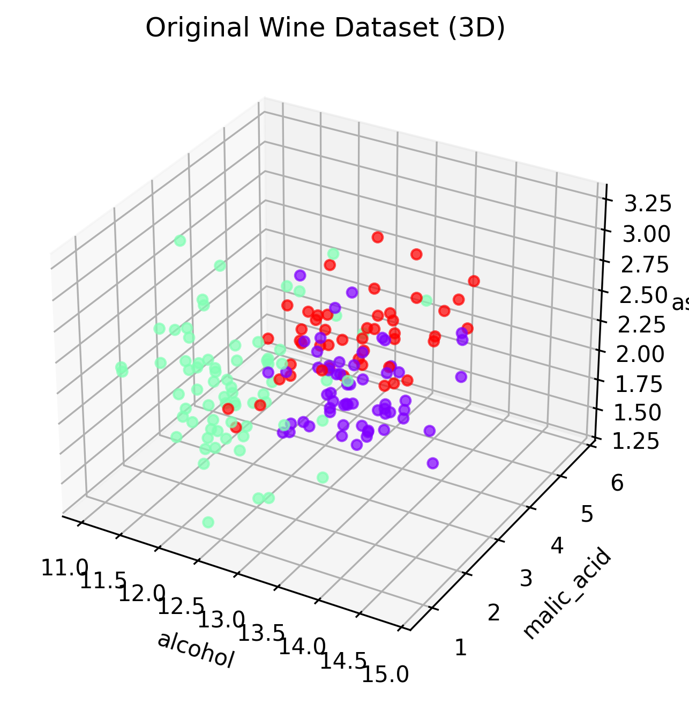
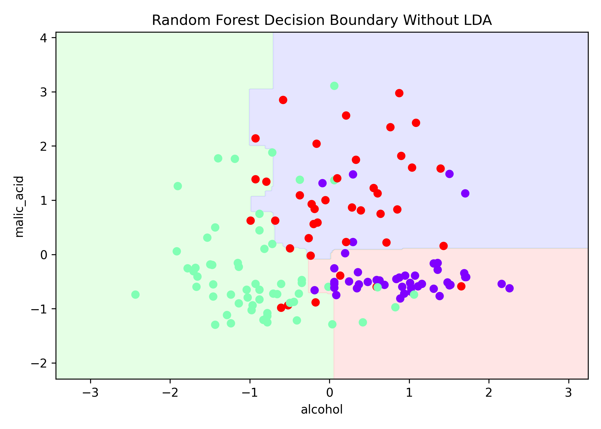
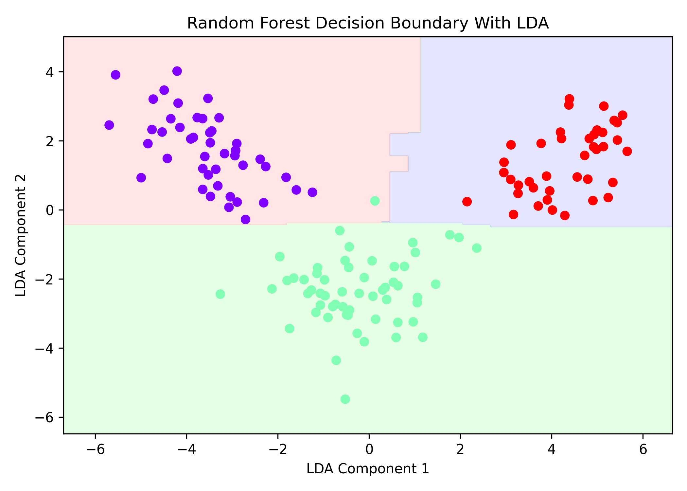

# Feature Reduction using LDA (Wine Dataset)

## 📌 Project Overview

This project demonstrates **feature reduction using Linear Discriminant Analysis (LDA)** on the Wine dataset.

The main objective is to reduce the number of features from **13 to 2** while preserving class separability and improving model performance.

---

## ⚙️ Workflow

1. Load Wine dataset
2. Standardize features
3. Train Random Forest classifier (without LDA)
4. Apply LDA to reduce dimensions
5. Train Random Forest classifier (with LDA)
6. Compare results using decision boundaries and accuracy

---

## 📊 Results

### 🔹 Original Dataset (3D Visualization)



### 🔹 Random Forest Without LDA



### 🔹 Random Forest With LDA



---

## 📈 Accuracy Comparison

Accuracy without LDA: 0.8611

Accuracy with LDA: 1.0000


---

## 🧠 Key Insight

* Original features: **13**
* Reduced features: **2**
* LDA improves **class separability** and often increases accuracy

---

## 🛠️ Technologies Used

* Python
* NumPy
* Pandas
* Matplotlib
* Scikit-learn

---

## ▶️ How to Run

1. Install dependencies:

```
pip install -r requirements.txt
```

2. Run the project:
```
python lda_wine.py
```
---

## 📁 Project Structure

```
LDA-Feature-Reduction/
│
├── lda_wine.py
├── README.md
├── requirements.txt
├── outputs/
│   ├── output1_original_3d.png
│   ├── output2_without_lda.png
│   ├── output3_with_lda.png
│   ├── accuracy.txt
```

---

## 🎯 Conclusion

LDA effectively reduces dimensionality while maintaining important class information, making models simpler and more efficient.

---
